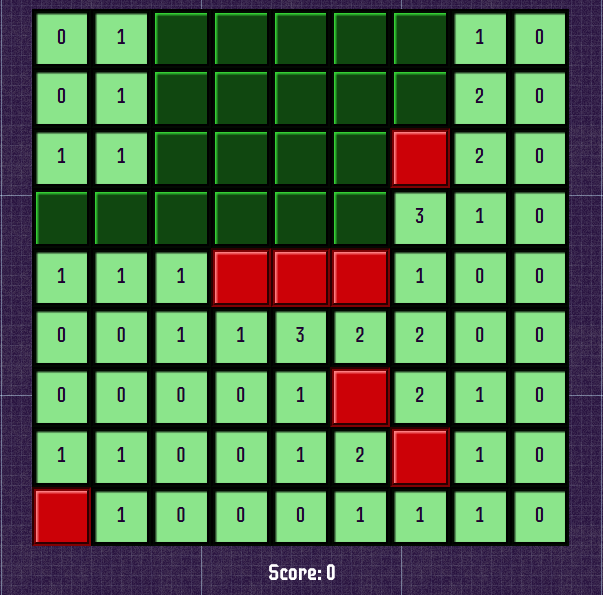

#JavaScript Minesweeper

<a href="http://adrianaalter.github.io/JSMinesweeper/">This</a> is a minesweeper game written in JavaScript, HTML5, and Sass.  It uses custom functions for randomization, inclusion checks, adding and removing classes, and recursively searching nodes,  Win 5 consecutive games to unlock surprise bonus content!

<a href="http://adrianaalter.github.io/MinesweeperGame/"></img></a>
